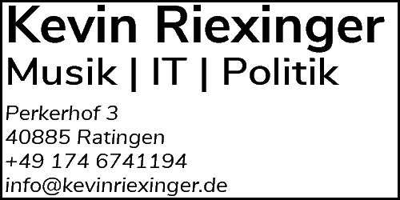

# Kevin´s CTF Challenges
## Für Frau Paar

___

#### Tools you need:
- [ ] Eine Linux Maschine (VM oder Gerät) mit Internet
  - Vorzugsweise Kali-Linux *(https://www.kali.org/downloads/)*
  - Bei Kali sind die viele Tools schon vorinstalliert.
- [ ] Visual Studio Code
  - Plugins:
    - [ ] Hex Editor *(ms-vscode.hexeditor)*
    - [ ] Markdown Preview *(shd101wyy.markdown-preview-enhanced)*
    - [ ] Python *(ms-python.python)*
    - [ ] optional einen Theme und/oder VSCode Icons :)
- [ ] Binwalk
- [ ] strings
- [ ] Audacity (dann auf Win Maschine)

***

#### Challenges:

##### Challenge01
>Sie haben eine Datei gegeben. Irgendwo in dieser Datei ist eine Flag versteckt.
##### Challenge02
>Sie haben eine Datei gegeben. Die Dateiendung ist falsch. Das richtige Dateiformat in der spezielen Freeware öffnen, dort finden sie die Flag.

PS: Halten sie ihr Handy parat:)
##### Challenge03
>Sie haben eine Datei gegeben. In diser Datei stecken mehrere andere Dateien. Finden sie die und ermitteln sie auch hier die Flag.

***
###### Flag Format: ####{*}
###### Quellen: ctflearn.com youtube.com

___

 <b>Kevin Riexinger</b> 

<a href="https://goo.gl/maps/QqA7RUYmDydCuQYA9">Perkerhof 3, 40885 Ratingen</a> || <a href="info@kevinriexinger.de">info@kevinriexinger.de</a> || <a href="tel:0714 6751194">0714 6751194</a> || <a href="kevinriexinger.de">kevinriexinger.de</a>
